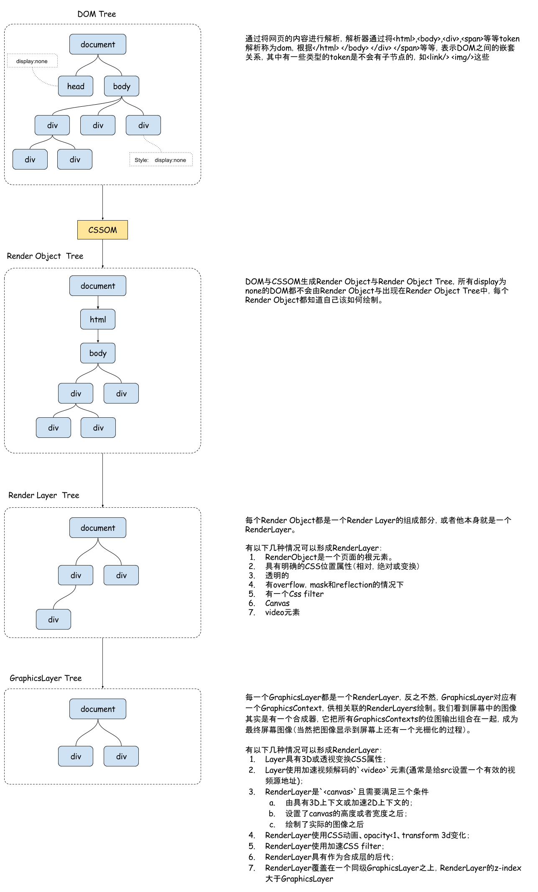
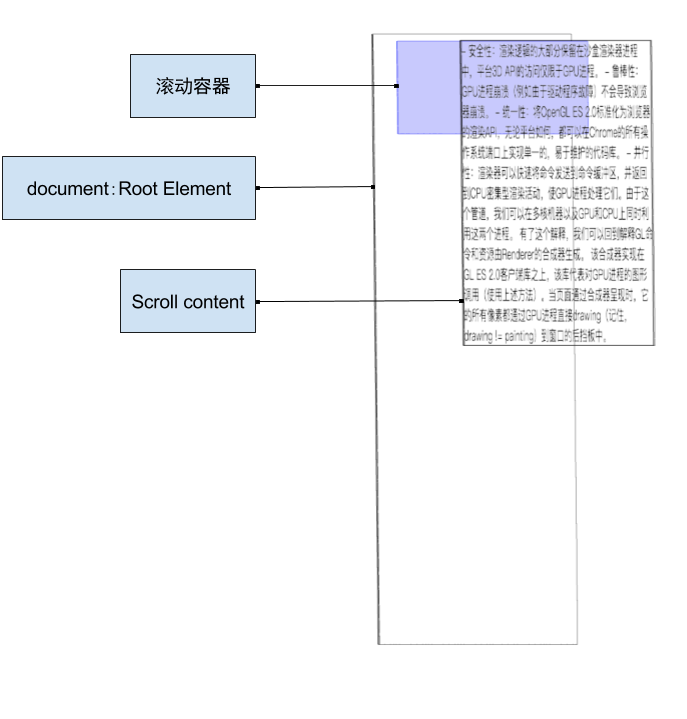
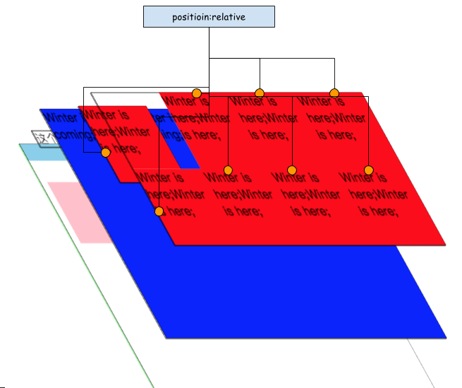
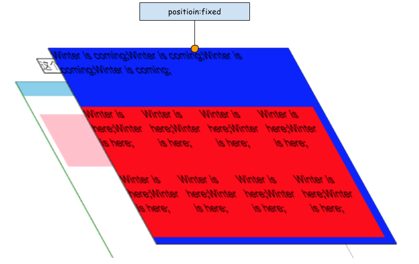
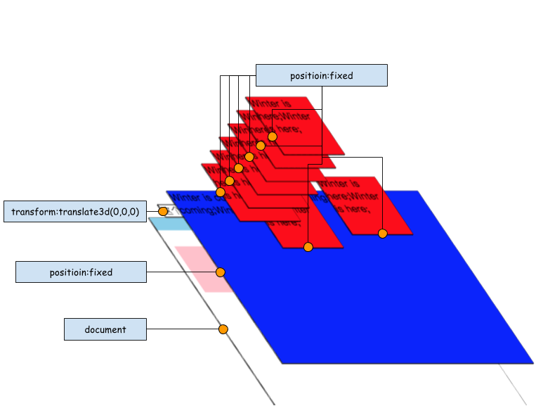
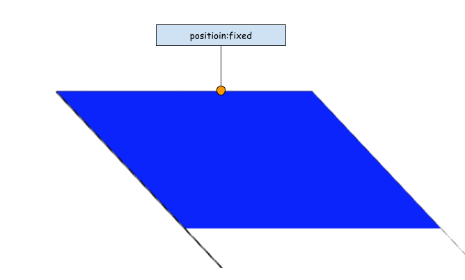
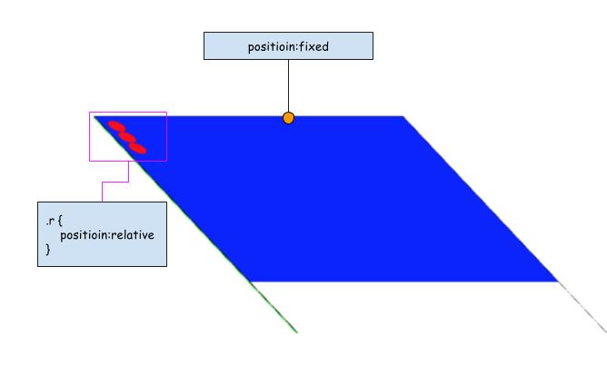

# What's layers

前端遇见最多的事情就是渲染了，比如改变大小，改变颜色，或者插入一个新节点。都会促使屏幕上的显示内容发生变化，那我们来看一下，在这些操作过程中到底都发生了一些什么？

## 从DOM到GraphicsLayer Tree
这是一个复杂的过程：下图简单的讲述了这个过程，当中还涉及到其他优化的知识，我们稍后再继续深入。


我们来看一下和前端最有关的RenderLayer和GraphicsLayer，在一些情况下RenderLayer和GraphicsLayer是可以转换的，我们来深入了解一下：
- 滚动：
不论是body上的滚动还是，单独容器上的滚动，都会产生两个GrahicsLayer，一个layer适用于存放容器的层，一个layer是用用于存放滚动内容的layer。这样做的原因是用来提高滚动时的性能。



- “position:absolute, relative, fixed, sticky”,“opacity”,“reflection”,“will-change:transform,opacity”
这些属性如果是单独在页面显示的情况下是不会出现单独的GraphicsLayer，触发的效果都是这些属性位于一个GraphicsLayer之上，而“transform”和“scroll”类型都是可以自己单独成层的，并且这些分层的效果不太一样；
    - 合并类型
        - relative／absoluste／opacity／mask:
            - 同种类型，没有重叠的情况：

                

                第一个会单独形成一个GraphicsLayer，其余同种类型会合成一个GraphicsLayer。

            - 同种类型，发生重叠情况：



            同种类型都是如果有一个position:relative的RenderLayer，重叠在一个position:relative的GraphicsLayer之上，该renderLayer会与GraphicsLayer合并。

    - 各自为营型
        - fixed／transform／animation／relection／will-change:transform,opacity:

            

            图中层次形成原因，首先我们来看一下源码
            首先我们看到图中有一个层的名字叫 ***document***，
            在其之上有一个GL的名字叫做`transform:translate3d(0,0,0)`,这是一个3d transform，固定会生成一个GraphicsLayer。在其之上满足GraphicsLayer形成条件的RenderLayer都会成为新的GraphicsLayer;
            ***will-change*** 是chrome59以上的一个功能，作用是会给一个未来有个能做动画的元素生成一个单独的GraphicsLayer，以免在动画开始的时候计算分离出单独的GraphicsLayer，这样会产生延迟。

### 合成层中容易遇到的问题。
renderLayer之间的合并有时会出现一些问题，通过这些问题我们可以更加深入的了解一下RenderLayer和GraphicsLayer之间的一些区别。之前说了“不是没有一个renderObject都可以成一个renderLayer的，并且并不是每一个renderLayer都可以生成一个GraphicsLayer”，所以一般情况下很难看出哪些是RenderLayer，但是根据部分RenderLayer之间会合并的情况，可以大概看一下RenderLayer如何合成在一起的。

    ```
    <!DOCTYPE HTML>
    <html>

    <head>
            <style>
                    .fixedelement {
                            position: fixed;
                            top: 0;
                            left: 0;
                            right: 0;
                            height: 300px;
                            background: blue;
                    }

                    .r {
                            border-radius: 10px;
                            height: 20px;
                            width: 20px;
                            background: red;
                    }

                    .relatedelementcontainer {
                            background: green;
                    }
            </style>
            <meta name="viewport" content="width=device-width,initial-scale=1.0, minimum-scale=1.0, maximum-scale=1.0, user-scalable=no,minimal-ui">
    </head>
    <body>
            <div class="fixedelement"></div>
            <div class="relatedelementcontainer">
                    <div class="r"></div>
                    <div class="r"></div>
                    <div class="r"></div>
            </div>

    </body>
    </html>
    ```


    - 首先`position:fixed`,`positioin:relative`,都会创建自己的renderLayer，如图上所示，由于`fixedelement`覆盖在`relatedelementcontainer`之上，并且由于body的内容没有产生滚动，所以`fixedelement`与`relatedelementcontainer`与 `document`层都合并成了一个GraphicsLayer。


    > 注意此时relatedelementcontainer中r没有`position:relative`属性


    

    - 再给r添加上`position:relative`之后，如下


```
.r {
        position: relative;
        border-radius: 10px;
        height: 20px;
        width: 20px;
        background: red;
}
```



有三个红点显示在左上角，原本被遮罩的红点显示出来了，但底部的绿色没有显示。这个说明了r由renderObject升级成了一个renderLayer，而renderLayer之间进行了合并。
