# 层的使用

前端遇见最多的事情就是渲染了，比如改变大小，改变颜色，或者插入一个新节点。都会促使屏幕上的显示内容发生变化，那我们来看一下，在了解什么是层之前，我们先来了解一下，从`Html Parse`->`GraphicsLayer Tree`在这些操作过程中到底都发生了一些什么？

## 从DOM到GraphicsLayer Tree
这是一个复杂的过程：下图简单的讲述了这个过程。


## Layer的形成条件
从上文看见整个形成过程中，只有两种层，一种是`RenderLayer`，一种是`GraphicsLayer`，对两者形成的条件进行比较

RenderLayer             | GraphicsLayer
------------------------|----------------------
页面元素的根目录           | #document
显示制定CSS位置的RenderObject节点。         | RenderLayer有一个Z坐标比自己小的兄弟节点，且该节点是一个合成层。
有透明效果的RenderObject | RenderLayer使用了CSS透明效果的动画或者CSS变换的动画。
节点有overflow,alpha或者反射效果的RenderObject节点 | 使用了Clip或者Reflection属性，并且他饿后代中包含一个合成层。
使用Canvas2D和3D（WebGL）技术的Renderobject节点 | RenderLayer包含的RenderObject节点表示的使用应加速的Canvas2D或者WebGL技术。
Video节点对应的`RenderObject`节点 | `RenderLayer`所包含的RenderObject节点表示的是使用硬件加速的视频解码技术的HTML5 video 元素
N/A    |RenderLayer使用了硬件加速CSS Filters技术
N/A     |RenderLayer具有CSS 3D属性或者CSS透视效果

> opacity:1 是不能提升成为`GraphicsLayer`的

以上内容摘自《webkit技术内幕》

## 为什么要有RenderLayer和GraphicsLayer
可以看的出，`GraphicsLayer`比`RenderLayer`定义的更加严谨，在满足一定条件的情况下`RenderLayer`可以转换成`GraphicsLayer`，为什么要有`RenderLayer`和`GraphicLayer`，本身RenderLayer就可以承载渲染所需要的渲染条件了，但是`GraphicLayer`存在是为更加高效的进行渲染。`GraphicLayer`对应GPU的硬件加速渲染，GPU很擅长处理层的合并，层的合并对应的绘制方式是`draw`，`RenderLayer`渲染方式对应`paint`。这两字很容易混淆，首先字面理解，`paint`对应的彩色的绘画，如油彩画，而draw对应的是显色更简单的铅笔画，如素描。paint你需要知道每一个像素的颜色，而`draw`并不用知道，只管用规定的颜色化就可以了。这就是为什么`draw`比`paint`更快的原因————“不用计算像素的颜色”。
- 滚动：
不论是body上的滚动还是，单独容器上的滚动，都会产生两个`GrahpicsLayer`，一个layer适用于存放容器的层，一个layer是用用于存放滚动内容的layer。这样做的原因是用来提高滚动时的性能。


通过记录我们发现`scroll`只会产生`Update Layers Tree`和`Composite Layers`的操作


在滚动的过程中没有产生任何`Paint`，只有`Update Layer Tree`和`Composite Layers`,所以极大的提高了性能。

> 所以本着好到用在刀刃上的原则，`GraphicsLayer`会用本身内容偏向稳定，而使用场景偏复杂的一些场景上。

## 层的3维空间
### 同一平面上的层
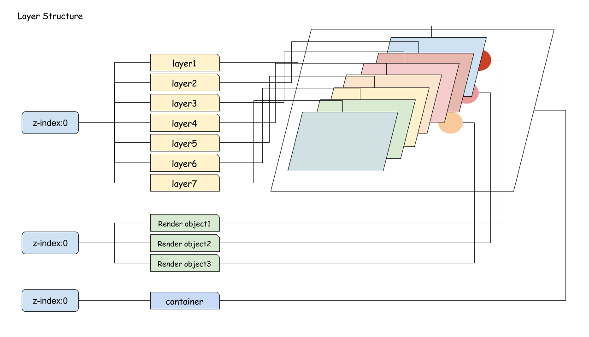

`container`是一个桌子，`RenderObject`是桌子上的花纹，而`RenderLayer`是摆在桌子上的牌，都是一个平面上的东西。所以同样都是`z-index`为0，`RenderLayer`有着比普通`RenderObject`更高的显示优先级，因为普通的`RenderObject`是属于`container`这一层的`layer`，也就是最底层。

#### z-index
那是不是`RenderObject`的显示优先级永远也无法比`RenderLayer`高了呢？不是这样的，之前提到过`z-index:0`的这个概念，对于有position概念的renderLayer,你可以将他的`z-index`设置为-1

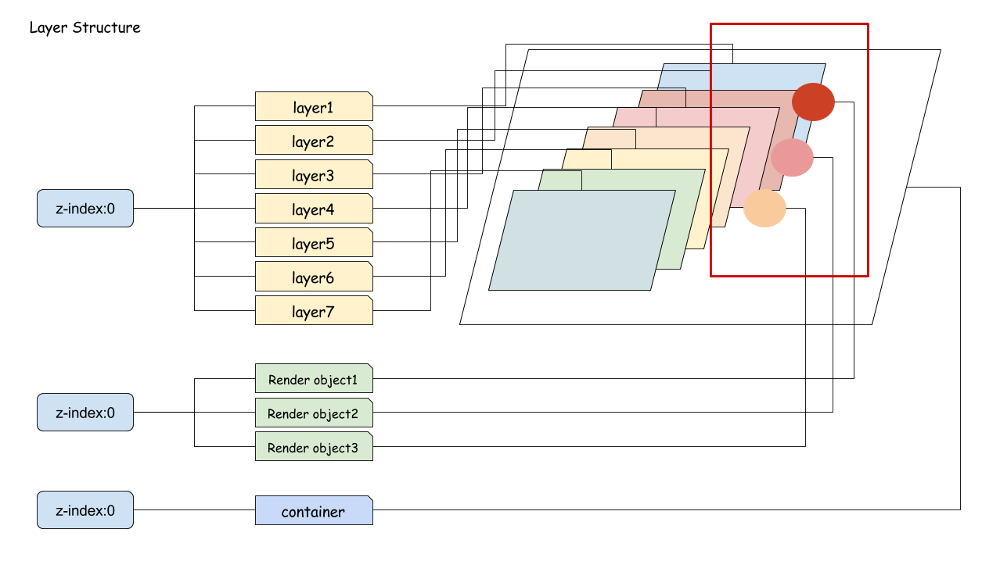

台子的花纹全都到上面来了，相当于放到了台板的背面。但是非`position`类型的`RenderLayer`是无法做到这一点的。

#### 重叠
`z-index`对于`RenderLayer`主要影响在于重叠，而重叠的主要后果在于两个：`RenderLayer`的合并以及`RenderLayer`升级为`GraphicsLayer`。
- renderLayer的合并：对于不同`z-index`的`RenderLayer`是不会产生层与层之间的合并的。合并的话题之后会详细讲述。
- renderLayer的升级：之前的对照表中详细说明了`RenderLayer`和`GraphicsLayer`的形成原因，其中，如果一个带有`position:relative,absolute`的`RenderLayer`如果覆盖在一个`GraphicsLayer`之上的化，这个`RenderLayer`就会被升级为`GraphicsLayer`，这里要重点说一下“升级”的事情，升级实际上是一个非常花费资源的操作，比如在做动画的时候，从`RenderLayer`升级到`GraphicsLayer`会对动画执行速度产生延时，请看一下例子：
一下每个绿色的圆形都是一个`position:relative`的`RenderLayer`，红色区域是一个`position:fixed`的`GraphicsLayer`，我们来复习一下：
- “所有带有位置信息的图层都会成一个`RenderLayer`”，
- 然后提前介绍一个新知识”当`position`：fixed的元素的容器内容超过容器高度，`position:fixed`的`RenderLayer`会单独形成一个`GraphicsLayer`”
- `RenderLayer`升级`GraphicsLayer`的策略。


上图中第一个图层3D模型中可以看到一共有4个GraphicsLayer

```
#document(292 x 2100)
.fixed(292 x 150)
.r(50 x 50)
.r(50 x 100)
```

`#document`是根层，`.fixed`是一个`position:fixed`的层，`.r(50 x 50)`是`opacity:0.5`的层，`.r(50 x 150)`是一个3个`.r(50 x 50)`合并而来；`.r`都是因为覆盖在`.fixed`之上而形成的`GraphicsLayer`，所以其他没有覆盖其上的'.r'都没有形成对应的`GraphicsLayer`


在滚动的过程中，由于`.fixed`的位置固定，会经历许多`.r`从`.fixed`的上方经过的过程，按照`GraphicsLayer`形成原理会多次形成`GraphicsLayer`；以下描述了滚动中出现的三种情况：


- case1:之前已经描述过，这里不再累述
- case2:是向上滚动，原本未覆盖的`RenderLayer`进入了`.fixed`的上方，所以会触发`Update Layer Tree`，然后触发三次`Paint`，最后触发`Composited Layers`；我们来查看一下`performance`:
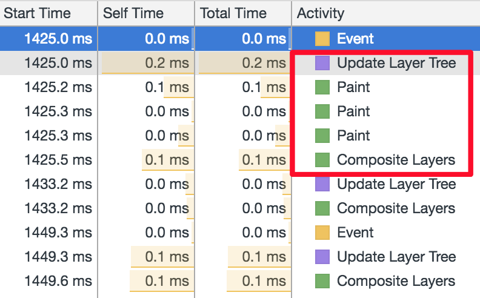

这里可以看到三个`paint`:

<table>
    <tr>
        <td>
        Location (0, -51);
        <nobr>Dimemsions (292 x 2100);</nobr>
        Layer Root #document;
        </td>
        <td>
        Location (0, -1);
        <nobr>Dimemsions (50 x 50);</nobr>
        Layer Root div.r
        </td>
        <td>
        Location (0, -51);
        <nobr>Dimemsions (50 x 150);</nobr>
        Layer Root div.r
        </td>
    </tr>
</table>

当第一个`.r`完全移出`.fixed`的范围之后，又会出现3次`Paint`，主要主要是因为，原本单独的 `.r`层因为不在`.fixed`之上的范围，所以重新被合入到`#document`之中，而原本的`.r (50 x 150)`有会分离出一个`.r (50 x 50)`和`.r (50 x 100)`两个层,所以一共有3个`GraphicsLayer`的内容产生了改变，所以产生了3次`Paint`:

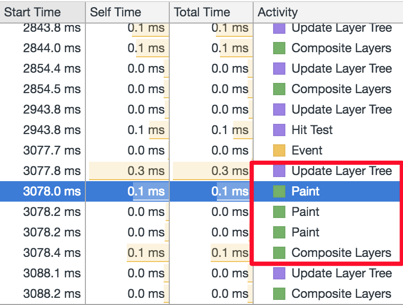

<table>
    <tr>
        <td>
        Location (0, -100);
        <nobr>Dimemsions (292 x 2100);</nobr>
        Layer Root #document;
        </td>
        <td>
        Location (0, 0);
        <nobr>Dimemsions (50 x 50);</nobr>
        Layer Root div.r
        </td>
        <td>
        Location (0, -51);
        <nobr>Dimemsions (50 x 100);</nobr>
        Layer Root div.r
        </td>
    </tr>
</table>

之前曾经说过，`Paint`由于需要计算每个像素的颜色，所以非常消耗资源，而在滚动中快速触发这种`Update Layer Tree`、`Paint`、`Paint`、`Paint`、`Compsite Layers`这种过程造成的性能消耗也是可想而知（有时会出现合并层的来不及显示的过程），如下图:

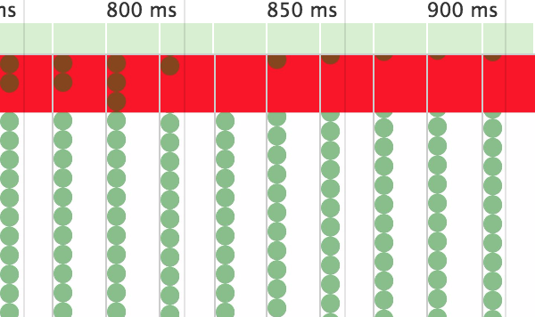

#### 何解决这个问题？
答案非常简单，可以将`.fixed`的node节点置于`.r`之后，或者直接提升或'.fixed'的`z-index`属性，两个方案的实质上都是提升了`z-index`；只要让覆盖在一个`GraphicsLayer`之上的条件失效就可以了。


## GraphicsLayer的类型
`position:absolute, relative, fixed, sticky`，`opacity`，`reflection`，`will-change:transform,opacity`，`transform:translateY`
这些属性如果是单独在页面显示的情况下是不会出现单独的`GraphicsLayer`，触发的效果都是这些属性位于一个GraphicsLayer之上，而`transform`和`scroll`类型都是可以自己单独成层的，并且这些分层的效果不太一样；

### 合并类型（relative／absoluste／opacity／mask）:
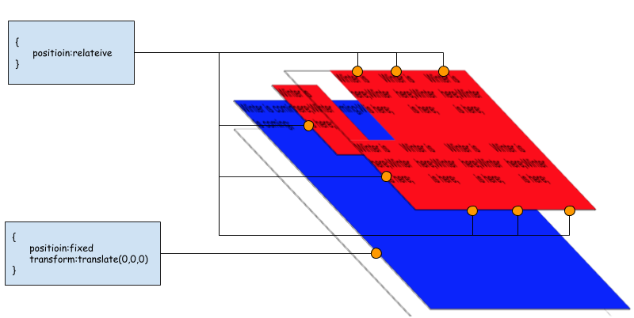

第一个会单独形成一个`GraphicsLayer`，其余同种类型会合成一个`GraphicsLayer`。

> relative/opacity混合效果也是一样的


### 独立型（各自为营）型 `fixed`／`transform`／`animation`／`relection`／`will-change:transform,opacity`/`overflow:scroll`:

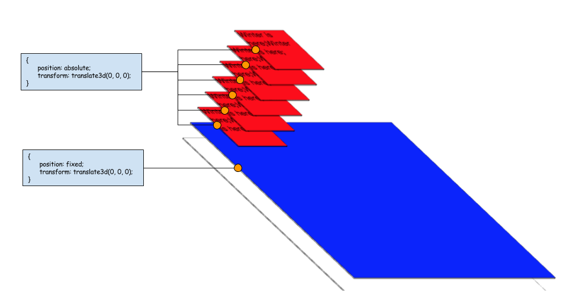

`scroll`与其他的独立层方式不同，一旦有`scroll`，会产生两个独立层;

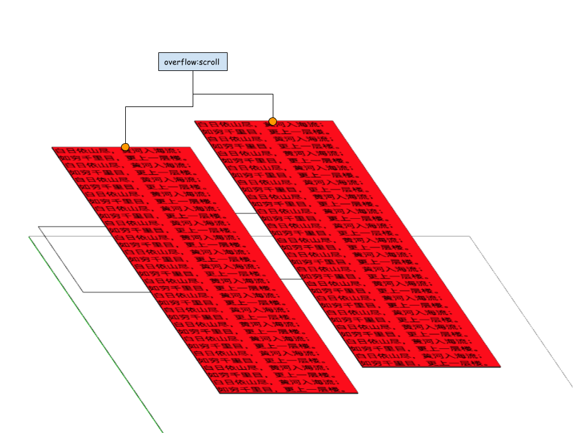


> ***will-change*** 是chrome59以上的一个功能，作用是会给一个未来有个能做动画的元素生成一个单独的`GraphicsLayer`，以免在动画开始的时候计算分离出单独的`GraphicsLayer`，这样会产生延迟。

### GraphicsLayer是否越多越好？
答案是No，Absolutely not，其实大家看到，就浏览器本身实现也分成合并型和独立型两种，其目的就是在于更好的节省资源和更好的性能体验，在dom数量一致的情况下，出现多个`GraphicsLayer`和只有一个`GraphicsLayer`的性能比较：

***内容部分***

```
<body>
        <div class="content">白日依山尽，黄河入海流，欲穷千里目，更上一层楼；白日依山尽，黄河入海流，欲穷千里目，更上一层楼；白日依山尽，黄河入海流，欲穷千里目，更上一层楼</div>
        <div class="content">白日依山尽，黄河入海流，欲穷千里目，更上一层楼；白日依山尽，黄河入海流，欲穷千里目，更上一层楼；白日依山尽，黄河入海流，欲穷千里目，更上一层楼</div>
        <div class="content">白日依山尽，黄河入海流，欲穷千里目，更上一层楼；白日依山尽，黄河入海流，欲穷千里目，更上一层楼；白日依山尽，黄河入海流，欲穷千里目，更上一层楼</div>
        <div class="content">白日依山尽，黄河入海流，欲穷千里目，更上一层楼；白日依山尽，黄河入海流，欲穷千里目，更上一层楼；白日依山尽，黄河入海流，欲穷千里目，更上一层楼</div>
        <div class="content">白日依山尽，黄河入海流，欲穷千里目，更上一层楼；白日依山尽，黄河入海流，欲穷千里目，更上一层楼；白日依山尽，黄河入海流，欲穷千里目，更上一层楼</div>
        <div class="content">白日依山尽，黄河入海流，欲穷千里目，更上一层楼；白日依山尽，黄河入海流，欲穷千里目，更上一层楼；白日依山尽，黄河入海流，欲穷千里目，更上一层楼</div>
        <div class="content">白日依山尽，黄河入海流，欲穷千里目，更上一层楼；白日依山尽，黄河入海流，欲穷千里目，更上一层楼；白日依山尽，黄河入海流，欲穷千里目，更上一层楼</div>
        <div class="content">白日依山尽，黄河入海流，欲穷千里目，更上一层楼；白日依山尽，黄河入海流，欲穷千里目，更上一层楼；白日依山尽，黄河入海流，欲穷千里目，更上一层楼</div>
        <div class="content">白日依山尽，黄河入海流，欲穷千里目，更上一层楼；白日依山尽，黄河入海流，欲穷千里目，更上一层楼；白日依山尽，黄河入海流，欲穷千里目，更上一层楼</div>
        <div class="content">白日依山尽，黄河入海流，欲穷千里目，更上一层楼；白日依山尽，黄河入海流，欲穷千里目， 更上一层楼；白日依山尽，黄河入海流，欲穷千里目，更上一层楼
        </div>
</body>
```

***数据对比***

来看一下layer数量对性能的影响
<table>
    <tbody>
        <tr>
            <td colSpan="2">Performance table</td>
        </tr>
        <tr>
            <td style="vertical-align:top;">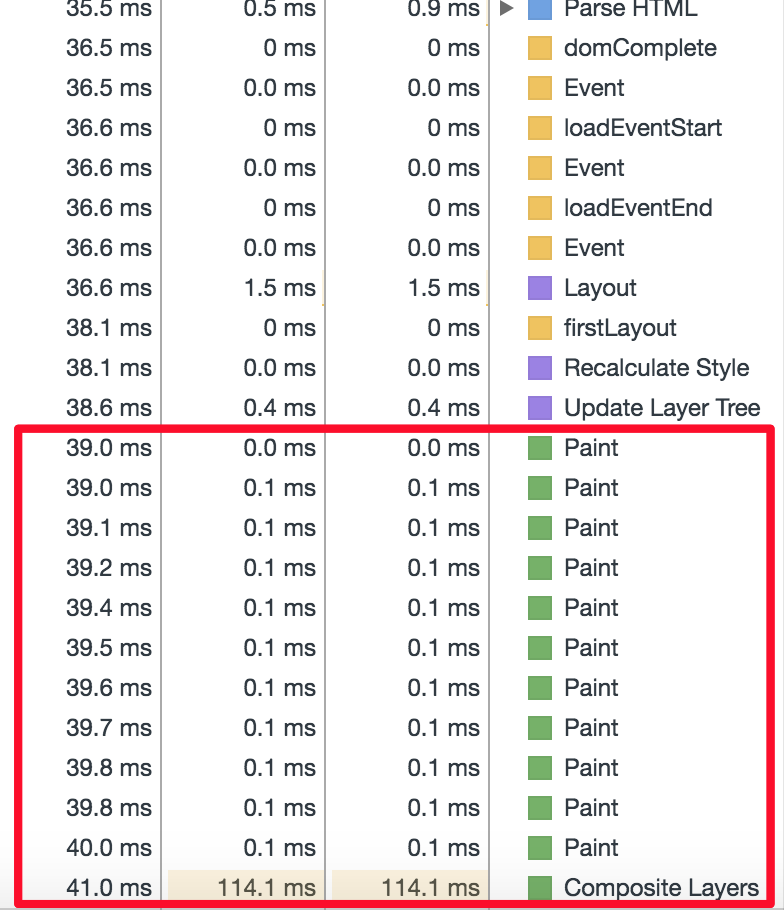</td>
            <td style="vertical-align:top;">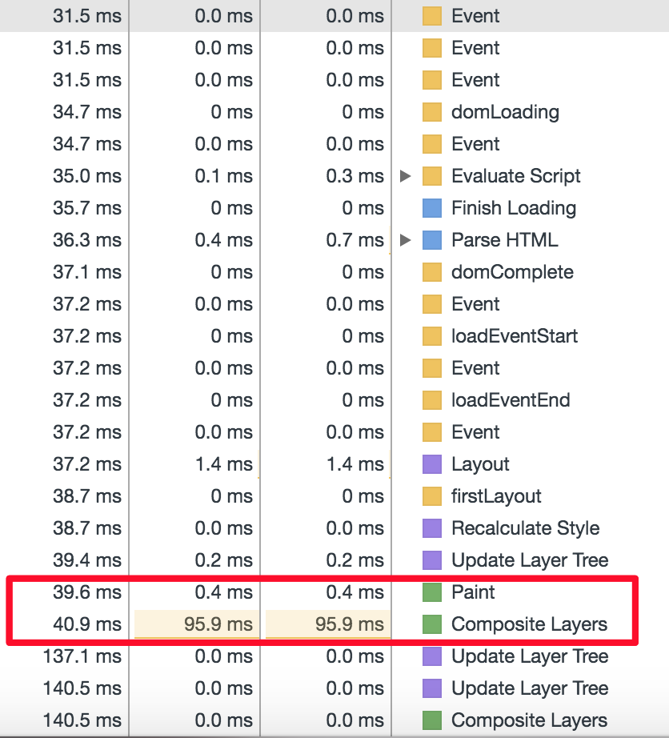</td>
        </tr>
        <tr>
            <td colSpan="2">Layer Veiw</td>
        </tr>
        <tr>
            <td style="vertical-align:top;">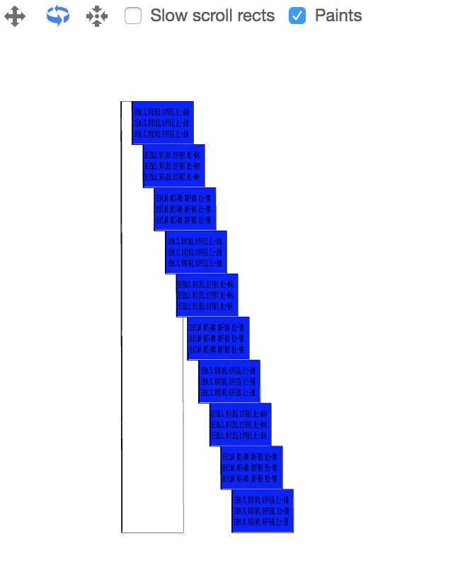</td>
            <td  style="vertical-align:top;">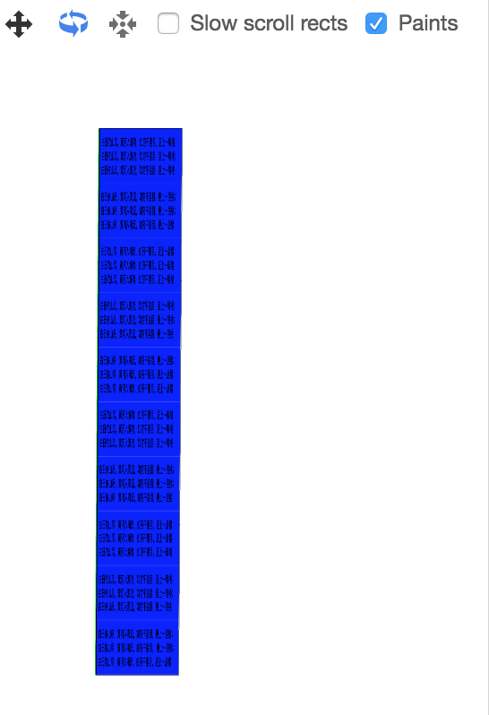</td>
        </tr>
    </tbody>
</table>

每个paint都意味着有一个composited layer产生，否则只会有一个layer，可以从性能对比中看到，composited layer越多，paint的次数也越多，并且composite layers的时间也就越长，对于首屏展现来说，是非常不利的。
