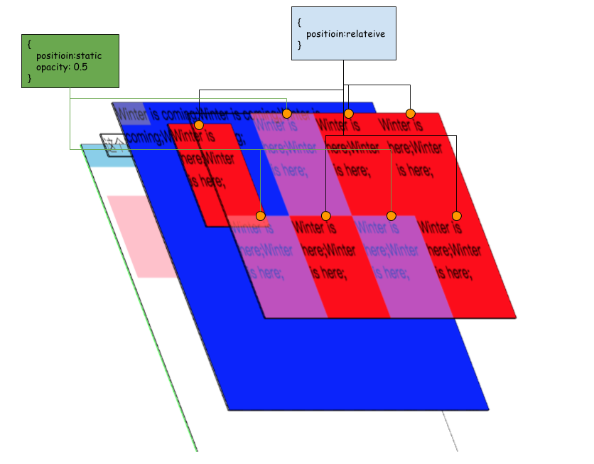
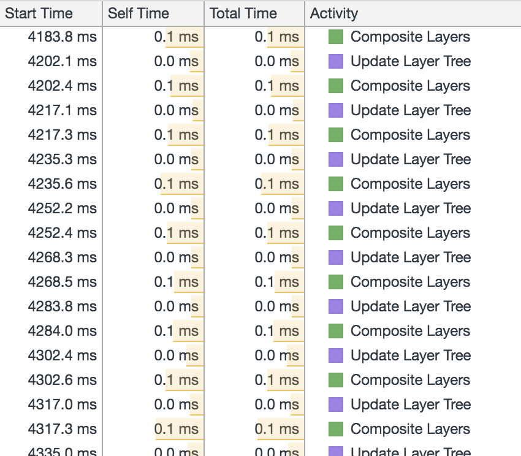

# 深入渲染

前端遇见最多的事情就是渲染了，比如改变大小，改变颜色，或者插入一个新节点。都会促使屏幕上的显示内容发生变化，那我们来看一下，在这些操作过程中到底都发生了一些什么？

## 从DOM到GraphicsLayer Tree
这是一个复杂的过程：下图简单的讲述了这个过程，当中还涉及到其他优化的知识，我们稍后再继续深入。


### Layer
从上文看见整个形成过程中，只有两个层一个RenderLayer，一个是GraphicsLayer，对两者形成的条件进行比较

RenderLayer             | GraphicsLayer
------------------------|----------------------
页面元素的根目录           | #document
显示制定CSS位置的RenderObject节点。         | RenderLayer有一个Z坐标比自己小的兄弟节点，且该节点是一个合成层。
有透明效果的RenderObject | RenderLayer使用了CSS透明效果的动画或者CSS变换的动画。
节点有overflow,alpha或者反射效果的RenderObject节点 | 使用了Clip或者Reflection属性，并且他饿后代中包含一个合成层。
使用Canvas2D和3D（WebGL）技术的Renderobject节点 | RenderLayer包含的RenderObject节点表示的使用应加速的Canvas2D或者WebGL技术。
Video节点对应的`RenderObject`节点 | `RenderLayer`所包含的RenderObject节点表示的是使用硬件加速的视频解码技术的HTML5 video 元素
                        |RenderLayer使用了硬件加速CSS Filters技术
                        |RenderLayer具有CSS 3D属性或者CSS透视效果

以上内容摘自《webkit技术内幕》

### 为什么要有RenderLayer和GraphicsLayer
可以看的出，`GraphicsLayer`比`RenderLayer`定义的更加严谨，在满足一定条件的情况下`RenderLayer`可以转换成`GraphicsLayer`，为什么要有`RenderLayer`和`GraphicLayer`，本身RenderLayer就可以承载渲染所需要的渲染条件了，但是`GraphicLayer`存在是为更加高效的进行渲染。`GraphicLayer`对应GPU的硬件加速渲染，GPU很擅长处理层的合并，层的合并对应的绘制方式是`draw`，`RenderLayer`渲染方式对应`paint`。这两字很容易混淆，首先字面理解，`paint`对应的彩色的绘画，如油彩画，而draw对应的是显色更简单的铅笔画，如素描。paint你需要知道每一个像素的颜色，而`draw`并不用知道，只管用规定的颜色化就可以了。这就是为什么`draw`比`paint`更快的原因——不用计算像素的颜色。

所以本着好到用在刀刃上的原则，`GraphicsLayer`会用本身内容偏向稳定，而使用场景偏复杂的一些场景上。如下面会提到的场景

### 层的3维空间
#### 同一平面上的层

`container`也是一个桌子，`RenderObject`是桌子上的花纹，而`RenderLayer`是摆在桌子上的牌，都是一个平面上的东西。所以同样都是`z-index`为0，`RenderLayer`有着比普通`RenderObject`更高的显示优先级，因为普通的`RenderObject`是属于`container`这一层的`layer`，也就是最底层。

#### z-index
那是不是`RenderObject`的显示优先级永远也无法比`RenderLayer`高了呢？不是这样的，之前提到过`z-index:0`的这个概念，对于有position概念的renderLayer,你可以将他的`z-index`设置为-1

台子的花纹全都到上面来了，相当于放到了台板的背面。但是非`position`类型的`RenderLayer`是无法做到这一点的。

##### 重叠
`z-index`对于`RenderLayer`主要影响在于重叠，而重叠的主要后果在于两个：`RenderLayer`的合并以及`RenderLayer`升级为`GraphicsLayer`。
- renderLayer的合并：对于不同`z-index`的`RenderLayer`是不会产生层与层之间的合并的。合并的话题之后会详细讲述。
- renderLayer的升级：之前的对照表中详细说明了`RenderLayer`和`GraphicsLayer`的形成原因，其中，如果一个带有`position:relative,absolute`的`RenderLayer`如果覆盖在一个`GraphicsLayer`之上的化，这个`RenderLayer`就会被升级为`GraphicsLayer`，这里要重点说一下“升级”的事情，升级实际上是一个非常花费资源的操作，比如在做动画的时候，从`RenderLayer`升级到`GraphicsLayer`会对动画执行速度产生延时，请看一下例子：
一下每个绿色的圆形都是一个`position:relative`的`RenderLayer`，红色区域是一个`position:fixed`的`GraphicsLayer`，我们来复习一下：
- “所有带有位置信息的图层都会成一个`RenderLayer`”，
- 然后提前介绍一个新知识”当`position`：fixed的元素的容器内容超过容器高度，`position:fixed`的`RenderLayer`会单独形成一个`GraphicsLayer`”
- `RenderLayer`升级`GraphicsLayer`的策略。


上图中第一个图层3D模型中可以看到一共有4个GraphicsLayer

```
#document(292 x 2100)
.fixed(292 x 150)
.r(50 x 50)
.r(50 x 100)
```

`#document`是根层，`.fixed`是一个`position:fixed`的层，`.r(50 x 50)`是`opacity:0.5`的层，`.r(50 x 150)`是一个3个`.r(50 x 50)`合并而来；`.r`都是因为覆盖在`.fixed`之上而形成的`GraphicsLayer`，所以其他没有覆盖其上的'.r'都没有形成对应的`GraphicsLayer`


在滚动的过程中，由于`.fixed`的位置固定，会经历许多`.r`从`.fixed`的上方经过的过程，按照`GraphicsLayer`形成原理会多次形成`GraphicsLayer`；以下描述了滚动中出现的三种情况：


- case1:之前已经描述过，这里不再累述
- case2:是向上滚动，原本未覆盖的`RenderLayer`进入了`.fixed`的上方，所以会触发`Update Layer Tree`，然后触发三次`Paint`，最后触发`Composited Layers`；我们来查看一下`performance`:

这里可以看到三个`paint`
<table>
    <tr>
        <td>
        Location (0, -51);
        <nobr>Dimemsions (292 x 2100);</nobr>
        Layer Root #document;
        </td>
        <td>
        Location (0, -1);
        <nobr>Dimemsions (50 x 50);</nobr>
        Layer Root div.r
        </td>
        <td>
        Location (0, -51);
        <nobr>Dimemsions (50 x 150);</nobr>
        Layer Root div.r
        </td>
    </tr>
</table>
当第一个`.r`完全移出`.fixed`的范围之后，又会出现3次`Paint`，主要主要是因为，原本单独的 `.r`层因为不在`.fixed`之上的范围，所以重新被合入到`#document`之中，而原本的`.r (50 x 150)`有会分离出一个`.r (50 x 50)`和`.r (50 x 100)`两个层,所以一共有3个`GraphicsLayer`的内容产生了改变，所以产生了3次`Paint`:

<table>
    <tr>
        <td>
        Location (0, -100);
        <nobr>Dimemsions (292 x 2100);</nobr>
        Layer Root #document;
        </td>
        <td>
        Location (0, 0);
        <nobr>Dimemsions (50 x 50);</nobr>
        Layer Root div.r
        </td>
        <td>
        Location (0, -51);
        <nobr>Dimemsions (50 x 100);</nobr>
        Layer Root div.r
        </td>
    </tr>
</table>
之前曾经说过，`Paint`由于需要计算每个像素的颜色，所以非常消耗资源，而在滚动中快速触发这种`Update Layer Tree`、`Paint`、`Paint`、`Paint`、`Compsite Layers`这种过程是这种性能也是可想而知（有时会出现合并层的来不及显示的过程），如下图


#### 何解决这个问题？
答案非常简单，可以将`.fixed`的node节点置于`.r`之后，或者直接提升或'.fixed'的`z-index`属性，两个方案的实质上都是提升了`z-index`；只要让覆盖在一个`GraphicsLayer`之上的条件失效就可以了。


- 滚动：
不论是body上的滚动还是，单独容器上的滚动，都会产生两个GrahicsLayer，一个layer适用于存放容器的层，一个layer是用用于存放滚动内容的layer。这样做的原因是用来提高滚动时的性能。


- “position:absolute, relative, fixed, sticky”,“opacity”,“reflection”,“will-change:transform,opacity”
这些属性如果是单独在页面显示的情况下是不会出现单独的GraphicsLayer，触发的效果都是这些属性位于一个GraphicsLayer之上，而“transform”和“scroll”类型都是可以自己单独成层的，并且这些分层的效果不太一样；
- 合并类型（relative／absoluste／opacity／mask）:
    - 没有重叠的情况：
    

    第一个会单独形成一个GraphicsLayer，其余同种类型会合成一个GraphicsLayer。

    **relative/opacity混合效果也是一样的**

    

    - 发生重叠情况：

    

    如果有一个合并类型的RenderLayer，重叠在一个`position:relative`的GraphicsLayer之上，该renderLayer会与GraphicsLayer合并。

- 各自为营型
    - fixed／transform／animation／relection／will-change:transform,opacity/overflow:scroll:

    

    scroll与其他的独立层方式不同，一旦有scroll，会产生两个独立层;
    
    通过记录我们发现scroll只会产生updatelayertree和compsitelayer的操作
    

- 图中层次形成原因，首先我们来看一下源码
首先我们看到图中有一个层的名字叫 ***document***，在其之上有一个GL的名字叫做`transform:translate3d(0,0,0)`,这是一个3d transform，固定会生成一个GraphicsLayer。在其之上满足GraphicsLayer形成条件的RenderLayer都会成为新的GraphicsLayer;***will-change*** 是chrome59以上的一个功能，作用是会给一个未来有个能做动画的元素生成一个单独的GraphicsLayer，以免在动画开始的时候计算分离出单独的GraphicsLayer，这样会产生延迟。

### 合成层中容易遇到的问题。
renderLayer之间的合并有时会出现一些问题，通过这些问题我们可以更加深入的了解一下RenderLayer和GraphicsLayer之间的一些区别。之前说了“不是没有一个renderObject都可以成一个renderLayer的，并且并不是每一个renderLayer都可以生成一个GraphicsLayer”，所以一般情况下很难看出哪些是RenderLayer，但是根据部分RenderLayer之间会合并的情况，可以大概看一下RenderLayer如何合成在一起的。


```
    <!DOCTYPE HTML>
    <html>

    <head>
            <style>
                    .fixedelement {
                            position: fixed;
                            top: 0;
                            left: 0;
                            right: 0;
                            height: 300px;
                            background: blue;
                    }

                    .r {
                            border-radius: 10px;
                            height: 20px;
                            width: 20px;
                            background: red;
                    }

                    .relatedelementcontainer {
                            background: green;
                    }
            </style>
            <meta name="viewport" content="width=device-width,initial-scale=1.0, minimum-scale=1.0, maximum-scale=1.0, user-scalable=no,minimal-ui">
    </head>
    <body>
            <div class="fixedelement"></div>
            <div class="relatedelementcontainer">
                    <div class="r"></div>
                    <div class="r"></div>
                    <div class="r"></div>
            </div>

    </body>
    </html>
```


- 首先`position:fixed`,`positioin:relative`,都会创建自己的renderLayer，如图上所示，由于`fixedelement`覆盖在`relatedelementcontainer`之上，并且由于body的内容没有产生滚动，所以`fixedelement`与`relatedelementcontainer`与 `document`层都合并成了一个GraphicsLayer。

> 注意此时relatedelementcontainer中r没有`position:relative`属性


- 再给r添加上`position:relative`之后，如下


```
.r {
        position: relative;
        border-radius: 10px;
        height: 20px;
        width: 20px;
        background: red;
}
```


有三个红点显示在左上角，原本被遮罩的红点显示出来了，但底部的绿色没有显示。这个说明了r由renderObject升级成了一个renderLayer，而renderLayer之间进行了合并。
