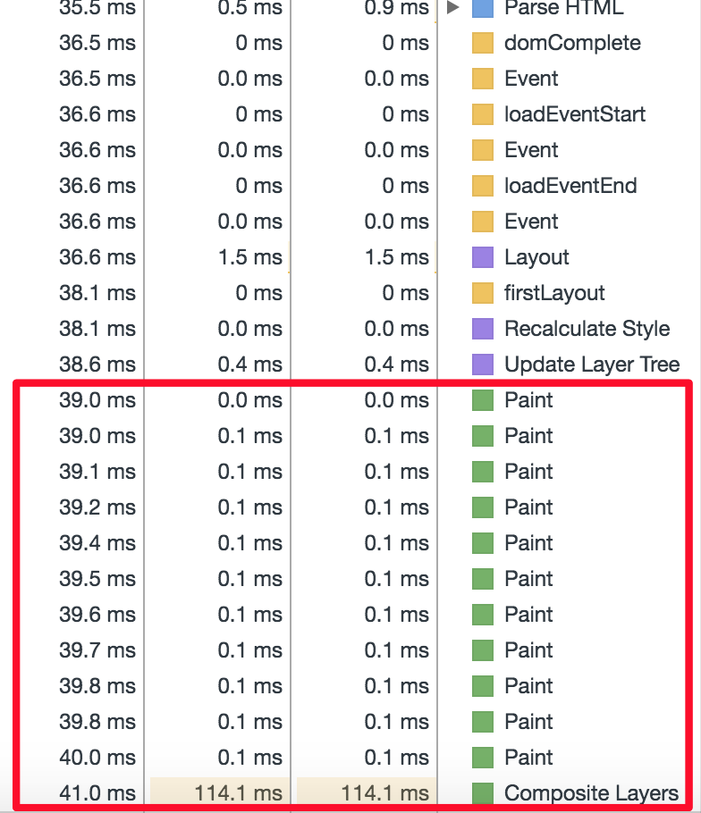
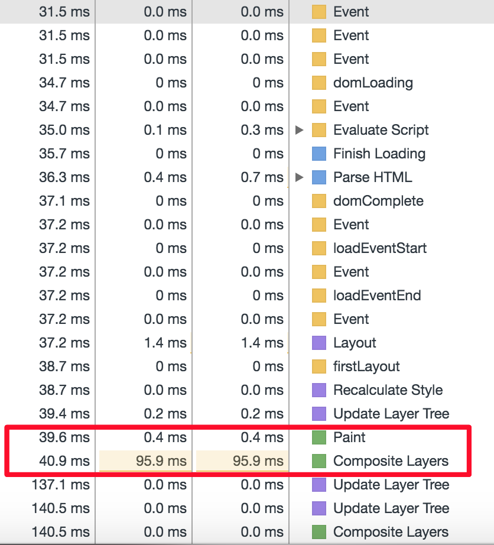
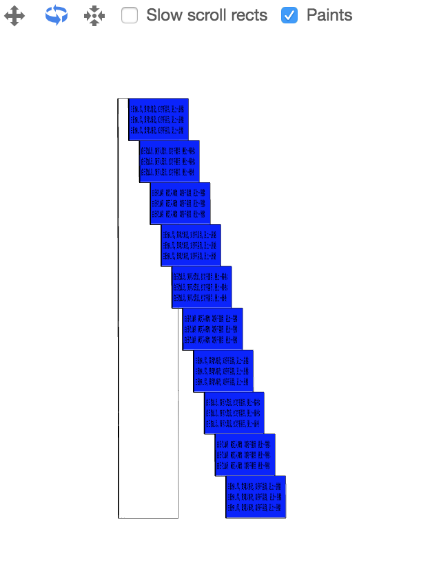
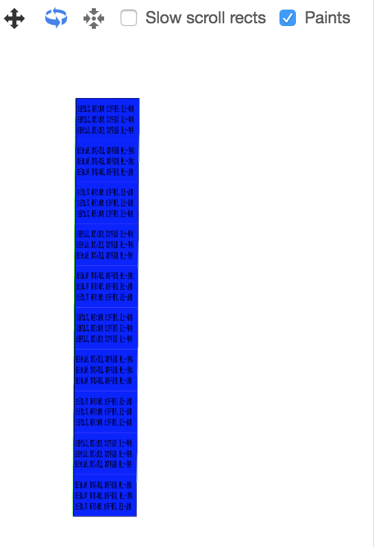

## Composited Layer with Render

Composited Layer越多越好呢？答案是No，Absolutely not，在dom数量一致的情况下：
```
<body>
        <div class="content">白日依山尽，黄河入海流，如穷千里目，更上一层楼；白日依山尽，黄河入海流，如穷千里目，更上一层楼；白日依山尽，黄河入海流，如穷千里目，更上一层楼</div>
        <div class="content">白日依山尽，黄河入海流，如穷千里目，更上一层楼；白日依山尽，黄河入海流，如穷千里目，更上一层楼；白日依山尽，黄河入海流，如穷千里目，更上一层楼</div>
        <div class="content">白日依山尽，黄河入海流，如穷千里目，更上一层楼；白日依山尽，黄河入海流，如穷千里目，更上一层楼；白日依山尽，黄河入海流，如穷千里目，更上一层楼</div>
        <div class="content">白日依山尽，黄河入海流，如穷千里目，更上一层楼；白日依山尽，黄河入海流，如穷千里目，更上一层楼；白日依山尽，黄河入海流，如穷千里目，更上一层楼</div>
        <div class="content">白日依山尽，黄河入海流，如穷千里目，更上一层楼；白日依山尽，黄河入海流，如穷千里目，更上一层楼；白日依山尽，黄河入海流，如穷千里目，更上一层楼</div>
        <div class="content">白日依山尽，黄河入海流，如穷千里目，更上一层楼；白日依山尽，黄河入海流，如穷千里目，更上一层楼；白日依山尽，黄河入海流，如穷千里目，更上一层楼</div>
        <div class="content">白日依山尽，黄河入海流，如穷千里目，更上一层楼；白日依山尽，黄河入海流，如穷千里目，更上一层楼；白日依山尽，黄河入海流，如穷千里目，更上一层楼</div>
        <div class="content">白日依山尽，黄河入海流，如穷千里目，更上一层楼；白日依山尽，黄河入海流，如穷千里目，更上一层楼；白日依山尽，黄河入海流，如穷千里目，更上一层楼</div>
        <div class="content">白日依山尽，黄河入海流，如穷千里目，更上一层楼；白日依山尽，黄河入海流，如穷千里目，更上一层楼；白日依山尽，黄河入海流，如穷千里目，更上一层楼</div>
        <div class="content">白日依山尽，黄河入海流，如穷千里目，更上一层楼；白日依山尽，黄河入海流，如穷千里目， 更上一层楼；白日依山尽，黄河入海流，如穷千里目，更上一层楼
        </div>
</body>
```
来看一下layer数量对性能的影响
<table>
    <tbody>
        <tr>
            <td colSpan="2">Performance table</td>
        </tr>
        <tr>
            <td style="vertical-align:top;"></td>
            <td style="vertical-align:top;"></td>
        </tr>
        <tr>
            <td colSpan="2">Layer Veiw</td>
        </tr>
        <tr>
            <td style="vertical-align:top;"></td>
            <td  style="vertical-align:top;"></td>
        </tr>
    </tbody>
</table>
每个paint都意味着有一个composited layer产生，否则只会有一个layer，可以从性能对比中看到，composited layer越多，paint的次数也越多，并且composite layers的时间也就越长，对于首屏展现来说，是非常不利的。
