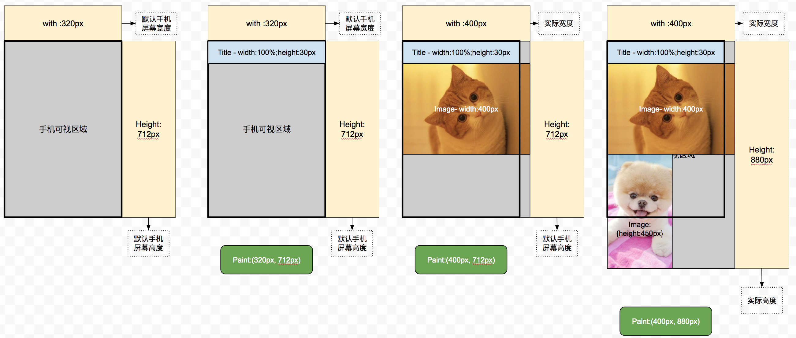

### What's Paint

Paint是把所有像素绘制到屏幕上的最后一步吗？
No，Absolutely not

首先说一下paint的范围，默认情况下，paint的范围是屏幕的可视范围是，假设可视范围是320x712，当body中的所有的元素堆砌的宽度和高度没有超过可视范围的时候，paint的范围始终是320x712，但是一旦DOM堆砌的是高度或者宽度超过可是范围之后，paint的高度或者高度就会按照超出的实际高度或者宽度来计算。
请看下面的图片：

