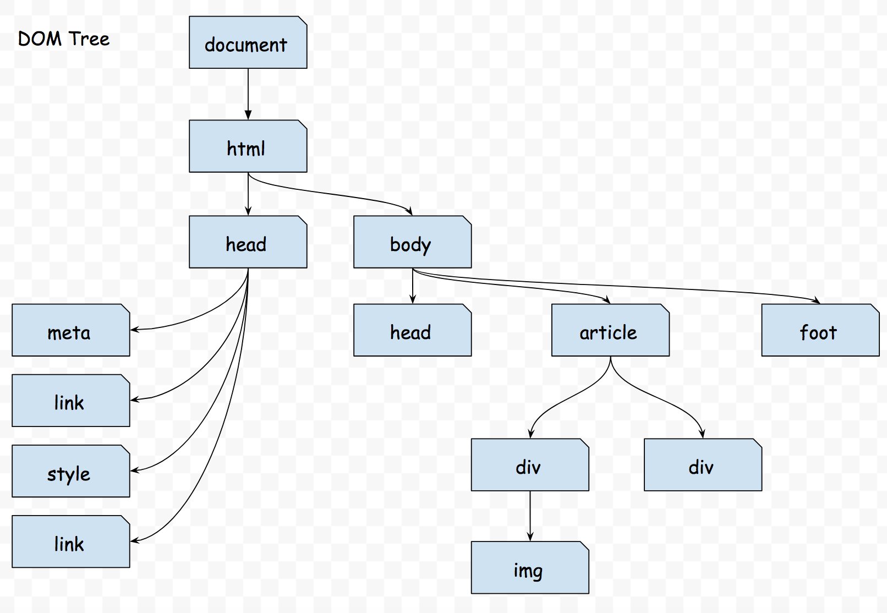

## HTML -> DOM
生成dom的timing是`domInteractive`;
首先在Parse Html的过程中html会遇到一些token，例如`<html>`、`<head>`、`<body>`、`<div>`、``、`<input/>`、`</div>`、`</body>`、`</head>`、`</html>`，里面有三种token，这个和具体算法有关，首先说一普通的`<html>`,`<body>`这种类型和``，`<input/>`这种类型，两者在进行Parser Html的时候都会直接生成DOM对象，区别在于后者不会包含任何子节点，前后有可能会包含子节点。举个例子：
```
<div>
    <label>A</label>
    <span>B</span>
</div>
```
parse html的顺序也是自上而下，自左到右的过程，当遇到`<div>`的时候，会生成一个div dom对象，然后接下遇到`<label>`，把label作为一个子dom(child)，接着又遇到了`</label>`token，这说明label dom的对象已经闭合，接下来与到dom token都会作为他的同级节点(sibling)，之后遇到了`<span>`token，有生成一个span的dom，然后遇到了</span>，说明了之后遇到dom token作为他的同级节点(sibling)，最后遇到了`</div>`，说明div dom已经闭合，接下来遇到dom token将作为div的同级节点(sibling);所以可见看见`</xxx>`这种类型token的只是用于告诉之后的节点是该闭合节点的同级节点（sibling）

DOM树的顶端是`document`节点，之后看一下，为什么dom树叫树，因为它长成这样：



## CSS -> CSSOM
[原本地址](https://developers.google.cn/web/fundamentals/performance/critical-rendering-path/constructing-the-object-model?hl=zh-cn)
- CSS和HTML是阻塞渲染的资源：
    - Why：
    首先Html是渲染的内容，如果没有html的内容，就没有内容可以渲染；
    如果没有css的话，渲染出来的内容也很有肯能没有办法使用；
同样css也会生成一个CSSOM的对象，CSSOM是一个css规则的树，他用来和DOM Tree结合

但是何时会生成一个CSSOM


## DOM Tree -> Render Tree
### RenderObject > RenderLayer
- 一个RenderObject总是直接与一个RenderLayer或者间接通过一个祖先RenderObject与一个RenderLayer相联系。
- 共享相同坐标空间的RenderObject（例如受同一css transform影响）通常属于相同的RenderLayer
- 由于RenderLayer的存在，使得页面元素的以正确的顺序合成，从而正确显示重叠的内容和半透明的元素。
- 有许多条件会触发为一个特定的RenderObject创建一个新的RenderLayer，以下使一些通常情况下会创建RenderLayer的条件：
    - RenderObject是一个页面的根元素。
    - 具有明确的CSS位置属性（相对，绝对或变换）
    - 透明的
    - 有overflow，阿尔法掩码（alpha mask）和反射的情况（reflection）
    - 有一个Css filter
    - canvas
    - video元素
- 需要注意的是，RenderObject与RenderLayer不是一一对应的，特定的RenderObject与为其创建的RenderLayer（如果有的话）相关联，或者与第一个祖先的RenderLayer相关联。
- RenderLayers也形成一个树状层次结构。根节点是与页面中的根元素相对应的RenderLayer，并且每个节点的后代都是可视化地包含在父层中的层。每个RenderLayer的子节点被保存在两个按升序排序的排序列表中，negZOrderList包含具有负z-索引（并且因此低于当前图层的层）的子层，而posZOrderList包含具有正z-索引的子层超过当前层的层）。

### RenderLayers -> GraphicsLayers
- 为了使用合成器，一些（但不是全部）RenderLayers获得自己的背面（具有自己的背面的层被广泛地称为合成层）。每个RenderLayer都有自己的GraphicsLayer（如果它是一个合成图层），或者使用它的第一个祖先的GraphicsLayer。这与RenderObject与RenderLayers的关系类似。
- 每个GraphicsLayer都有一个GraphicsContext，供相关联的RenderLayers绘制。该合成器最终负责将GraphicsContexts的位图输出组合在一起，成为后续合成过程中的最终屏幕图像。

    > 在理论上，每一个RenderLayer都可以将其自身绘制成单独的背景表面，实际上这在记忆方面（VRAM尤其如此）可能是相当浪费的。在当前的Blink实现中，必须满足以下条件之一才能使RenderLayer获得自己的合成图层（请参阅[CompositingReasons.h](https://code.google.com/p/chromium/codesearch#search/&q=file:CompositingReasons.h)）：

    - Layer具有3D或透视变换CSS属性；
    - Layer使用加速视频解码的`<video>`元素；
    - Layer由具有3D上下文或加速2D上下文的`<canvas>`元素使用；
    - Layer用于合成插件；
    - Layer使用CSS动画的不透明度或使用动画的Webkit转换；
    - Layer使用加速CSS过滤器；
    - Layer具有作为合成层的后代；
    - Layer具有具有较低z-索引的兄弟姐妹，其具有合成层（换句话说，该层与合成层重叠，并且应该被覆盖在其上）；


### 涂层压缩(Squash Layer)
如上所述，GraphicsLayers在存储器和其他资源方面可能是昂贵的（例如，一些关键操作具有与GraphicsLayer树的大小成比例的CPU时间复杂度）。可以为RenderLayer创建许多其他层，这些层与其自己的背面重叠，这可能是昂贵的。

> repainting:     we need to rerender every pixel and figure out what the color it is(costly), redrawing means we already know the color of pixel and it need to display it(cheap).

#### Stacking Contenxt

> Paint order of a stacking Context
 - Backgrounds and borders;
 - Negative z-index children;
 - Normal flow element;
 - z-index == 0 and/or absolute positioned children
 - Postive z-index

#### Reasons to Make a Composited Layer
合成可以让渲染子树从缓存和分组中中收益：
- 更容易将某些效果应用于子树
    - e.g. opacity, transforms, filters, reflections
- 元素移动时不会触发重绘
    - e.g. scrolling, fixed-position elements
- 对于需要使用硬件加速的内容更加实用
    - e.g. video, webGL
- 保持正常的绘制顺序
- 确保样式属性正确传播到合成图层树


#### 重叠测试（Overlapping Test）
目的：通过避免创建不需要创建的合成层来节省内存；
对大多数RenderLayers需要昂贵的转换界限
合成原因取决于布局


##### 合成中的主要计算
- 确定我们可能要复合每个RenderLayer的原因
- 将每个RenderLayer分配给合成背景
- 创建合成的GraphicsLayer树
    - 根据需要分配／销毁GraphicsLayer
    - 把这些层拼成一棵树
    - 初始化树的所有属性（例如位置，大小，不透明度，变换，背面可见性等）

#### 总结一下四种层
- **DOM树**：基础模式，所有DOM对象的树形结构
- **RenderObject树**：具有与DOM树的可见节点的1：1映射。 RenderObject知道如何绘制相应的DOM节点。
- **RenderLayer树**：由RenderLayers组成，映射到RenderObject树上的RenderObject。
映射是多对一的，因为每个RenderObject都与其自己的RenderLayer或其第一个祖先的RenderLayer相关联，RenderLayer树保留层之间的z顺序。
- **GraphicsLayer树**：映射GraphicsLayers一对多RenderLayers。
每个GraphicsLayer都具有使用Chrome与Chrome合成器层实现的Web层。合成器最终操作的就是这些cclayer（chrome compsited layer）。


### 组合器
Chrome的合成器是用于管理GraphicsLayer树和协调帧生命周期的软件库。

回想一下，渲染发生在两个阶段：第一次绘制，然后是复合。这允许合成器在每个合成层的基础上执行额外的工作。例如，在合成之前，合成器负责将必要的变换（由层的CSS变换属性指定）应用于每个合成层的位图。此外，由于层的涂覆与合成分离，因此无效这些层之一仅导致单独重新涂覆该层的内容物并重新合成。

每次浏览器需要创建一个新的帧，合成器绘制。注意这个（混淆）的术语区别：绘图是将图层组合成最终屏幕图像的合成器;而绘画是层次背景（软件光栅化的位图;硬件光栅化中的纹理）的群体。而绘画要知道每个像素的信息（软件光栅化的位图;硬件光栅化中的纹理）。

那么GPU是如何发挥作用的呢？合成器使用GPU来执行drawing过程，而老的软件渲染是通过渲染进程传递一张有关页面内容的位图给浏览器进程来显示。

在硬件加速架构中，是通过调用特定的3D API在GPU上进行合成（windows上是D3D，其他平台使用GL），渲染器的合成器通常使用GPU绘制页面的矩形区域到一张位图上，作为最终的页面图片。

### GPU进程架构提供以下好处：

- 安全性：渲染逻辑的大部分保留在沙盒渲染器进程中，平台3D API的访问仅限于GPU进程。
- 鲁棒性：GPU进程崩溃（例如由于驱动程序故障）不会导致浏览器崩溃。
- 统一性：将OpenGL ES 2.0标准化为浏览器的渲染API，无论平台如何，都可以在Chrome的所有操作系统端口上实现单一的，易于维护的代码库。
- 并行性：渲染器可以快速将命令发送到命令缓冲区，并返回到CPU密集型渲染活动，使GPU进程处理它们。由于这个管道，我们可以在多核机器以及GPU和CPU上同时利用这两个进程。

有了这个解释，我们可以回到解释GL命令和资源由Renderer的合成器生成。


### The Threaded Compositor
该合成器实现在GL ES 2.0客户端库之上，该库代表对GPU进程的图形调用（使用上述方法）。当页面通过合成器呈现时，它的所有像素都通过GPU进程直接drawing（记住，drawing != painting）到窗口的后挡板中。


合成器的架构随着时间的推移而发展：最初它生活在渲染器的主线程中，然后被移动到自己的线程（所谓的合成器线程），然后在paint发生时进行额外的责任编排（所谓的侧面绘画）。本文将重点介绍最新版本;请参阅GPU架构路线图，了解旧版本可能仍在使用中。

理论上说，螺纹合成器的基本任务是从主线程获取足够的信息，以便响应未来的用户输入而独立生成帧，即使主线程繁忙并且不能被要求提供其他数据。实际上，这意味着它会在视口的当前位置周围的区域内为层区域复制cc层树和SkPicture记录。

### 录制：从Blink的角度来看Painting
“兴趣区域”是SkPictures记录的视口周围的区域。当DOM改变时，例如因为某些元素的样式现在与以前的主线程帧不同，并且已被认为无效，Blink会将感兴趣区域内的无效层的区域绘制到 “SkPicture-backed GraphicsContext”。这实际上不产生新的像素，而是产生产生这些新像素所需的Skia命令的显示列表。此显示列表将在以后用于在合成器自行决定时生成新像素。

### 提交：对合成器线程的切换
“The Threaded Compositor”的关键属性是对主线程状态的副本进行操作，因此它可以不用通过询问主线程就可以生成帧。因此“The Threaded Compositor”有两面，一个是主线程侧，一个是“impl”侧，主线程有一个有一个LayerTreeHost，是一个LayTree的拷贝，Impl有一个LayerTreeHostImpl，也是一个LayerTree的拷贝。

理论上来讲，这个两个LayerTrees是完全独立的，合成器的Impl县城的拷贝可以不和主线程有任何交互就可以产生帧。这就意味着当主线程忙于运行javascript的时候，合成器仍然可以在GPU上redraw之前提交的内容而不会被打断。

为了生成新的帧，合成器线程需要知道如何修改其状态。因此，一些输入事件（如滚动）从浏览器进程转发到合成器，然后从那里转到渲染器主线程。在其控制下输入和输出，螺纹合成器可以保证对用户输入的视觉响应。除滚动之外，合成器还可以执行任何其他页面更新，不需要要求Blink重新绘制任何内容。到目前为止，CSS动画和CSS过滤器是唯一其他主要的合成器驱动的页面更新。

两个LayerTree通过一系列合成器的调度器提交的信息进行同步，这个提交将主线程的状态传输到合成器的线程（包括updated layer tree，任何新的SkPicture记录），通过阻塞主线来触发同步，
这是主线程涉及特定帧生产的最后一步。

在合成层自己的线程当中允许合成器的laytree的副本不用设计主线程就可以进行性层次变化，但是呢，主线程有时也需要直到例如滚动偏移量的一些信息用于最终定位viewport滚动到哪里，因此提交信息同样也适用于合成器线程向主线程更新。


有趣的是，这种架构是JavaScript触摸事件处理程序阻止合成滚动的原因，但滚动事件处理程序不会。 JavaScript可以在触摸事件上调用preventDefault（），但不能在滚动事件上调用。因此，如果要取消传入的触摸事件，合成器无法首先询问JavaScript（在主线程上运行），就无法滚动页面。另一方面，滚动事件无法防止并异步传递给JavaScript;因此，无论主线程是否立即处理滚动事件，合成器线程都可以立即开始滚动。


### Tree Activation（树激活）
当合成器线程从主线程获取新的层树时，它会检查新树，以查看哪些区域无效并重新光栅化这些图层。在此期间，活动树仍然是合成器线程以前的旧层树，并且挂起的树是其内容被光栅化的新图层树。

为了保持所显示的内容的一致性，只有当其可见（即，在视口内）高分辨率内容被完全光栅化时才激活挂起的树。从当前活动树切换到现在就绪的挂起树被称为激活。等待内容清晰的净效果意味着用户通常可以看到至少一些内容，但该内容可能会过时。如果没有可用的内容Chrome可以使用GL shader来显示空白或“棋盘区”。

需要重点关注的是，即使是活动的树，也可以滚动经过rastered区域，因为Chrome只会记录兴趣区域内的图层区域的SkPicture。如果用户向为记录区域滚动，合成器会向主线程要求记录和提交附加内容，如果新的内容没有及时的被记录、提交和光栅化用以激活新的layertree，那用户将会滚动到一个“棋盘区”。

为了尽量避免“棋盘效应”，chrome会在挂起生成完一个高分辨率的内容前快速光栅化一个低分辨率的内容。低分辨率的视图窗口挂起树会在如果比当前显示的内容要好就会被显示（比如当前窗口的激活树没有可光栅化的内容），瓦片管理起就会决定使用什么内容进行光栅化。

该架构将光栅化与其余帧生产流程隔离开来。它支持各种可以提高图形系统响应能力的技术。图像解码和调整大小操作是异步执行的，这是先前昂贵的在绘画过程中执行的主线程操作。本文前面提到的异步纹理上传系统也是使用impl-side绘制的。


### 瓦片／平铺（Tiling）

栅格化页面上每一层的整体都是浪费CPU时间（绘画操作）和内存（RAM用于层需要的任何软件位图;纹理存储的VRAM）。合成器不是光栅化整个页面，而是将大多数Web内容图层分解为图块，并以每个图块为基础对图层进行光栅化。

Web内容层瓦片通过许多因素来启发式地优先化，包括瓦片与视口的接近度以及其在屏幕上的估计时间。然后根据GPU的优先级将GPU存储器分配给瓦片，并且从SkPicture录像中对瓦片进行分类，以优先顺序填充可用的内存预算。目前（2014年5月），重新划分优先次序的具体方法;有关更多信息，请参阅Tile优先级设计文档。

请注意，对于其内容已经驻留在GPU上的图层类型（例如加速视频或WebGL）瓦片化不是必需的。
