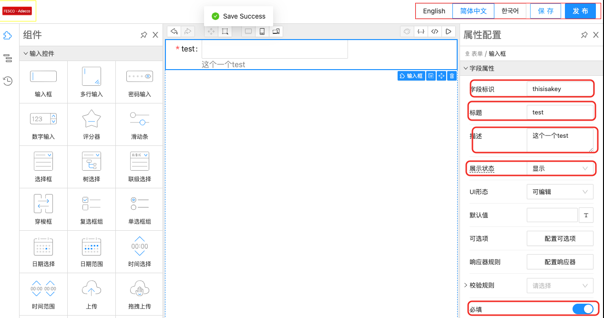
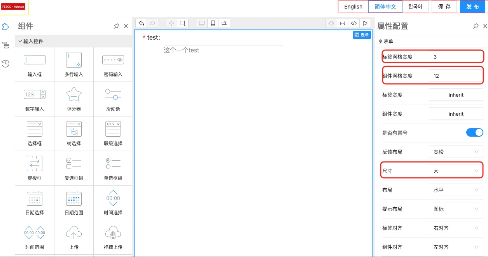

## 设计器生成schema

通过design做一个简单schema，


| input设置                                                | form设置                                                 |
| -------------------------------------------------------- | -------------------------------------------------------- |
|  |  |

```javascript
{
	"form": {
		"labelCol": 3,
		"wrapperCol": 12,
		"size": "large"
	},
	"schema": {
		"type": "object",
		"properties": {
			"thisisakey": {
				"type": "string",
				"title": "test",
				"x-decorator": "FormItem",
				"x-component": "Input",
				"x-validator": [],
				"x-component-props": {},
				"x-decorator-props": {},
				"description": "这个一个test",
				"x-display": "visible",
				"enum": [],
				"required": true,
				"name": "thisisakey",
				"x-designable-id": "v1uh3a5tjmb",
				"x-index": 0
			}
		},
		"x-designable-id": "dic4d42bqfx"
	}
}
```


## 设计器加载Schema

```javascript
import { GlobalRegistry } from '@designable/core';
import { useDesigner } from '@designable/react';
import { observer } from '@formily/react';
import { useEffect } from 'react';
import { loadInitialSchema } from '../service';

export const ActionsWidget = observer(() => {
    const designer = useDesigner();
    useEffect(() => {
        loadInitialSchema(designer);
    }, []);
});
```

```javascript
export const loadInitialSchema = (designer: Engine) => {
    try {
        designer.setCurrentTree(
            transformToTreeNode(
                JSON.parse(localStorage.getItem('formily-schema')),
            ),
        );
    } catch {}
};
```
